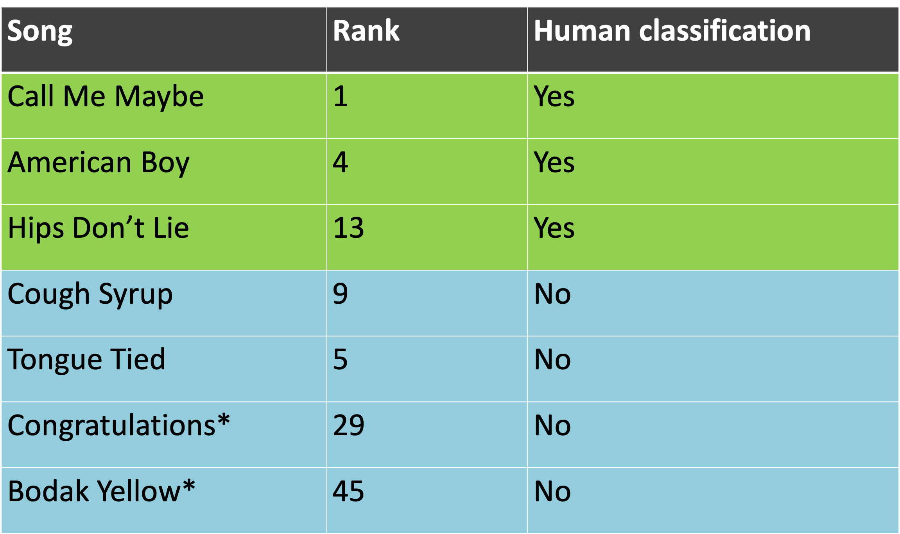

# Song Querying by Humming
*A system to recognize choruses of songs from a user's hum*  
  
*EECS 352 || Machine Perception of Music || Professor Bryan Pardo || Northwestern University*

### Our Team
- Rohaan Advani || rohaanadvani2019@gmail.com
- Carlos Belardi || carlosbelardi2019@gmail.com
- Vishal Giridhar || vishalgiridhar2020@u.northwestern.edu

### Motivation
Most people have at some point in their life struggled with a song being stuck in their head, and no options to find out what its called. With most commercial systems these days, only when the song is played in real-time would it be able to recognize it and label it with the title. SoundHound is the only well-known method that exists to query a song by humming, even though a number of research papers have been written on said topic. As a result, we were curious if we could create our own query-by-humming systeem. We believe the chorus is the most distinguishable part of a song, and is the melody that is most likely to be ingrained into a listener's mind.

### Our Journey
When it comes to how our code works. For both the humming audio and all of our songs, we create a chromagram. This chromagram shows 12 notes per sample (0.2 secs), and each note has a value from 0-1 relating to how prevalent that note is. We find the most prominent note for each sample, and create a waveform using those. Once the waveform is created, we do pattern matching by calculating the cosine distance between our hum and each song. We then return the songs with the top 10 scores, and ideally the song we're looking for is in those results.

Our process for developing this approach was quite hectic. We began with a completely different approach where we used the Melodia and Vamp python libraries to extract the melody of each song, and get a frequency array of those melodies. Once we had those frequencies, we kept track of the changes in frequencies with three string options: 'u'=up, 's'=same, and 'd'=down. We created arrays of these frequency changes for our hum samples, and for our initial database which contained the .wav files of 10 songs. At first we were getting really good results, with our correct song showing up in the top 3 results for each of the three humming samples we had. However, when we expanded our database to include all 50 songs we wanted, our results deteriorated completely. Now the correct songs weren't even in the top 10 results, which is not good.

We quickly pivoted and tried to do many different things to try and get better results. The first decision we made was to scale down the project, and focus only on song choruses. Then we tried performing an STFT on our wave file, then using a similar frequency change algorithm but got poor results. We also tried using all of the chromagram information, rather than finding the highest value but that didn't work well. Finally we tried pattern matching waveforms with cross-correlation instead of cosine but also got subpar results. Through this trial and error we got our final approach of extracing the notes from the chromagram, creating waveforms, and calculating the cosine distance. 

### Results
Once we began testing our final approach we got somewhat mixed results. First off, we discovered that songs with heavy bass or lack of clear melody (mostly hip hop songs) didn't perform well using this approach. On the other hand, songs that have very defined melodies and where the singer hits some high notes performed very well. In the chart below, we show off 7 songs that we tested. A song's rank is determined by our matching algorith, with a rank of 1 meaning that it's the predicted best match, and with 50 meaning it's the predicted worst match. For human classification, we wanted to see if a human listener could identify the correct song after listening to the hums we had recorded. The chart shows off 5 songs that performed pretty well (where the correct song was predicted to be in the top 10-15 matches), and 2 songs (hip hop ones) that performed poorly. This is just 7 out of the 50 songs we had in our database. But overall we found that the success of our algorithm heavily relied on the main song's chorus. Songs with a lot of instrumental interference (guitars, bass, etc.) didn't perform too well. We debated using REPET to seperate vocals and instruments, but realized that the iconic choruses of some songs included instruments that users would likely hum (Sweet Caroline being a notable example). Overall, we think our query-by-humming system works decently. But a lot more fine tuning is needed for our system to perform super well with any song that's fed into it.

### Image

In this graph for the song American Boy we can see the two waveforms we've created, and one can see how some parts of the hum waveform perfectly match the chorus waveform if it were shifted over a bit. This is taken into consideration in our cosine distance calculation and when a hum has a graph like this, it's usually a sign that it'll have a high score.

### Audio Samples

Here are some humming samples that worked well, along with their respective chorus

[Call Me Maybe Hum](https://drive.google.com/file/d/1M-oC6E-_hhZWQT3fqLF8SmwMYXbM4r1R/view?usp=sharing)

[Call Me Maybe Chorus](https://drive.google.com/file/d/1qZ1D-FjgmPoyStMHrKRmnYlkPEwiLYM5/view?usp=sharing)

[American Boy Hum](https://drive.google.com/file/d/1q8F8b6z8zB8Po5ff8JOIXFdOB0edkM67/view?usp=sharing)

[American Boy Chorus](https://drive.google.com/file/d/1Fa-16J_riiKL9YifF3AinvV8NP5Yxoif/view?usp=sharing)

Here are some humming samples that didn't work well, which we mainly found to be hip hop songs

[Congratulations Hum](https://drive.google.com/file/d/1iJOR218XuG43Iu7ZD1cldOci57-B8bsO/view?usp=sharing)

[Congratulations Chorus](https://drive.google.com/file/d/1ckHFmTTaUXp_XoJBxhd7LKwWt6e96tee/view?usp=sharing)

[Bodak Yellow Hum](https://drive.google.com/file/d/1H3tleen2fNeJmvdqKq-mlC4sO76qtntx/view?usp=sharing)

[Bodak Yellow Chorus](https://drive.google.com/file/d/1Zwvy-3Vnm_hABzPX6L8qUgbib0SK0rSW/view?usp=sharing)
